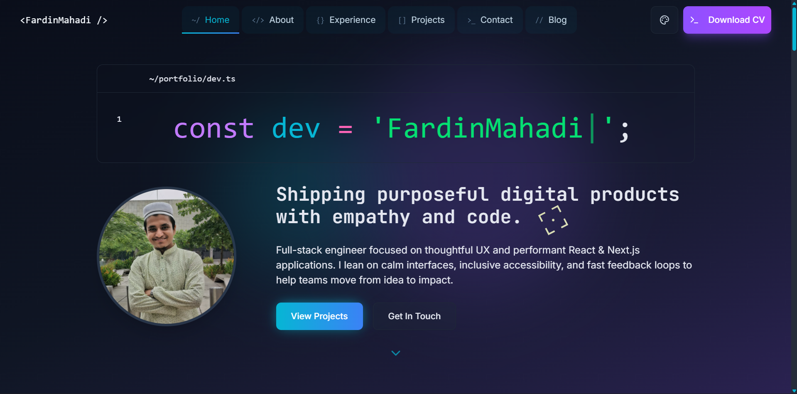

# 🚀 FardinMahadi's Developer Portfolio

VS Code–inspired portfolio for **Mahadi Hasan Fardin**, highlighting projects, writing, and contact entry points with a cohesive theme system, rich interactions, and content sourced from structured JSON.

## [Live Link ↗︎](https://fardinmahadi.vercel.app/)



---

## ✨ Highlights

### Design & UX

- Theme-aware layout powered by Tailwind CSS design tokens
- Multiple palette presets (cyan/blue, violet, emerald, etc.) with instant transitions
- Responsive hero, timeline, and lightbox experiences for desktop → mobile
- Terminal-flavoured elements (contact form, 404, error boundary) to reinforce the developer brand

### Interactions & Motion

- Animated cursor layer on non-blog routes and blog-specific cursor follow effect
- Framer Motion reveals for section headings, cards, and scroll indicators
- GSAP-backed hero cursor and magnetic buttons for subtle depth
- Project gallery modal with keyboard navigation and thumbnail previews

### Content & Architecture

- Data-driven sections using JSON (`projects`, `blogPosts`, `socialLinks`) and typed loaders in `src/lib`
- Blog index with category filter, theme-ready cards, and per-post metadata
- Blog post layout with theme-aware gradients and structured data (JSON-LD)
- Error boundary & not-found pages restyled to match the primary theme tokens

---

## 🧰 Tech Stack

- **Next.js 15** (App Router) & **React 19**
- **TypeScript** throughout
- **Tailwind CSS v4** with custom tokens
- **Framer Motion** & **Motion** for animations
- **GSAP** for advanced cursor motion
- **shadcn/ui** for accessible component primitives
- **Lucide Icons** for iconography
- **Resend** email integration (contact form)

---

## ⚙️ Getting Started

```bash
# 1. Clone
git clone https://github.com/FardinMahadi/Portfolio.git
cd portfolio

# 2. Install deps
npm install

# 3. Run dev server
npm run dev
# open http://localhost:3000
```

### Environment Variables (optional for contact form)

Create `.env.local`:

```
RESEND_API_KEY=re_your_api_key
CONTACT_EMAIL=your-email@example.com
RESEND_FROM_EMAIL=onboarding@resend.dev
```

---

## 🗂️ Project Structure (simplified)

```
src/
├── app/
│   ├── layout.tsx            # Root layout with theme + cursor layer
│   ├── page.tsx              # Landing page composition
│   ├── blog/                 # Blog index + article routes
│   ├── not-found.tsx         # Themed 404
│   └── api/contact/route.ts  # Resend handler
├── components/
│   ├── LandingPage/          # Hero, About, Projects, Blog, Contact, Footer...
│   ├── blog/                 # Listing and article renderer
│   ├── effects/              # Cursor, modals, scroll indicator, etc.
│   ├── types/                # Shared prop interfaces
│   └── ui/                   # shadcn/ui wrappers
├── contexts/                 # Color palette provider
├── data/                     # JSON content (blogPosts, projects, social links)
├── lib/                      # Data loaders, SEO helpers, theme palettes
└── styles/                   # Global Tailwind config (globals.css)
```

---

## 🎨 Theming & Customisation

- Palettes defined in `src/lib/colorPalettes.ts` and consumed by `ColorPaletteContext`
- Components reference utilities like `bg-(--color-background)`, `text-theme-*`, `border-theme-*`
- Edit or add palettes to instantly reskin the site; state persists via `localStorage`

### Component-Specific Tokens

- Surface gradients use lightweight `color-mix` inline helpers—wrap in functions if you introduce more variants.
- Error & 404 templates share aesthetics; extend via a shared fallback layout if adding new systemic pages.

---

## 📝 Managing Content

- **Projects** → `src/data/projects.json` (typed loader in `src/lib/projects.ts`)
- **Blog Posts** → `src/data/blogPosts.json` (rendered via `MarkdownRenderer`)
- **Social Links** → `src/data/socialLinks.json` (consumed in `ContactSection`)
- Update hero/about copy directly in their respective `LandingPage` components.

---

## 🧩 Key Components

- **ProjectsSection**: Grid + lightbox modal with keyboard navigation, themed overlays
- **BlogIndexPage**: Filterable list, theme-aware cards, structured data injection
- **BlogPostContent**: Article layout, metadata, themed buttons, theme gradient backgrounds
- **ContactSection**: Terminal-styled form with Resend fallback, JSON-driven socials
- **Cursor Layers**: Global `TargetCursor` is suspended on blog routes; blog cursor uses `CursorFollow` labels
- **ProjectScreenshotModal**: Theme-aware gallery with thumbnails, accessible focus trap
- **ErrorBoundary / Not Found**: Custom fallback surfaces matching the global palette

---

## 🚀 Deployment

```bash
npm run build    # production build (.next/)
npm run start    # preview production

# Vercel CLI
npm i -g vercel
vercel

# Netlify CLI
npm i -g netlify-cli
netlify deploy --prod
```

---

## 🤝 Contributing

Issues and PRs welcome. Please review:

- [Style Guide](./doc/STYLE_GUIDE.md)
- [AI Training Guide](./doc/AI_TRAINING_GUIDE.md)

---

## 📄 License

MIT — see [LICENSE](./LICENSE).

---

## 👤 Author

**Mahadi Hasan Fardin**

- Portfolio: [fardinmahadi.vercel.app](https://fardinmahadi.vercel.app/)
- GitHub: [@FardinMahadi](https://github.com/FardinMahadi)
- LinkedIn: [mahadi-hasan-fardin](https://www.linkedin.com/in/mahadi-hasan-fardin)

---

> ⭐ If this portfolio inspires you, consider starring the repo!
